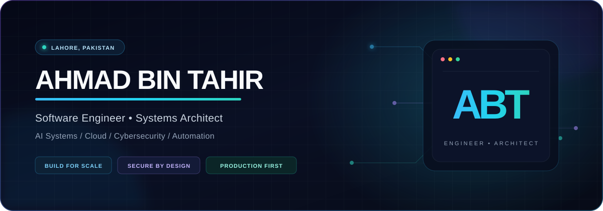
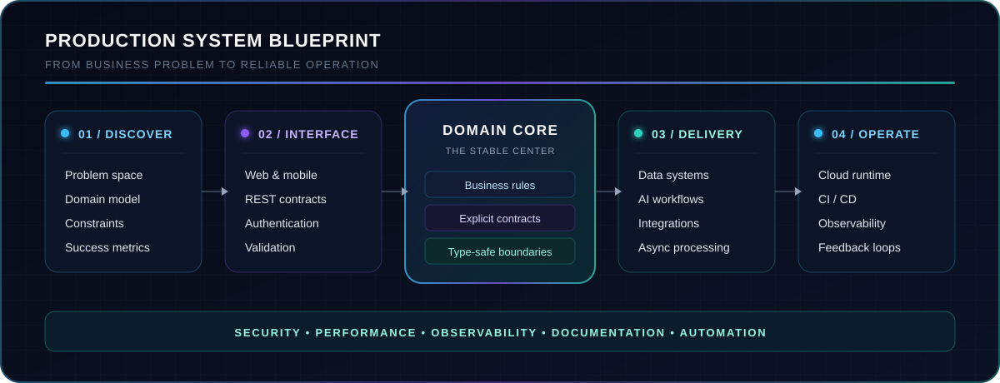

  

  

  
  
  
  
  

  
   
  <b>Engineer by discipline · Architect by instinct · Entrepreneur by mindset</b>

---

### The engineer behind the systems

I am **Ahmad Bin Tahir**, a software engineer and systems architect from Lahore, Pakistan, currently pursuing a Bachelor's degree in **Cybersecurity at the University of Central Punjab**.

I wrote my first code at around ten years old, beginning with Unity and C#. That curiosity grew into a career spanning full-stack products, backend platforms, AI systems, cloud infrastructure, automation, security engineering, and large-scale software architecture. Today, I focus on turning difficult business and engineering problems into systems that are **secure, scalable, observable, and maintainable**.

My standard is not _“does it work?”_ It is _“will it remain correct, understandable, and reliable as the product, team, and traffic grow?”_

<table>
  <tr>
    <td width="25%" align="center"><b>Building since ~10</b> a lifelong engineering path</td>
    <td width="25%" align="center"><b>Production first</b> not prototype theatre</td>
    <td width="25%" align="center"><b>Security minded</b> from design to deploy</td>
    <td width="25%" align="center"><b>Entrepreneurial</b> engineering meets business</td>
  </tr>
</table>

### What I engineer

<picture>
  <source media="(max-width: 650px)" srcset="./assets/architecture-blueprint-mobile.svg" />
  
</picture>

| Domain | What I bring to the table |
| :--- | :--- |
| **Software architecture** | Clean boundaries, modular systems, SOLID design, thoughtful abstractions, and explicit trade-offs |
| **Backend & platforms** | Secure APIs, authentication/authorization, data modeling, service design, caching, queues, and performance work |
| **AI engineering** | LLM integrations, agents, multi-agent workflows, RAG, prompt systems, computer vision, and production AI delivery |
| **Cloud & automation** | Reproducible environments, CI/CD, deployments, infrastructure thinking, observability, and workflow automation |
| **Security engineering** | Threat-aware design, least privilege, secure defaults, defensive validation, and cybersecurity research |
| **Product development** | Responsive full-stack experiences that balance business value, developer experience, and long-term maintainability |

### Technology radar

<b>Languages & core engineering</b>

 

  
  

<b>Frontend, backend & application platforms</b>

 

  

<b>Data, cloud & delivery</b>

 

  

<b>AI, computer vision & engineering tools</b>

 

  

> **AI systems I work with:** LLM integrations · AI agents · Multi-agent systems · RAG · Prompt engineering · Azure AI Foundry · OpenAI APIs · Anthropic Claude · OpenCV · YOLO

### Engineering principles

| Architect for change | Secure every boundary | Measure before optimizing |
| :---: | :---: | :---: |
| Prefer explicit contracts | Keep coupling low | Automate repeatable work |
| Make failure observable | Document the _why_ | Ship maintainable systems |

### Current trajectory

- Designing production-grade software and distributed backend systems.
- Building useful AI agents and RAG workflows with strong evaluation and guardrails.
- Deepening cybersecurity expertise through my degree and applied research.
- Creating scalable digital products and engineering partnerships through **ABT Dev Services**.
- Exploring the intersection of AI, automation, cloud platforms, and secure software architecture.

### GitHub telemetry

<picture>
  <source media="(prefers-color-scheme: dark)" srcset="https://github-profile-summary-cards.vercel.app/api/cards/profile-details?username=AhmadBinTahir&theme=tokyonight" />
  <source media="(prefers-color-scheme: light)" srcset="https://github-profile-summary-cards.vercel.app/api/cards/profile-details?username=AhmadBinTahir&theme=github" />
  
</picture>

  

  

<picture>
  <source media="(prefers-color-scheme: dark)" srcset="https://github-readme-activity-graph.vercel.app/graph?username=AhmadBinTahir&bg_color=070B17&color=94A3B8&line=22D3EE&point=8B5CF6&area=true&hide_border=true" />
  <source media="(prefers-color-scheme: light)" srcset="https://github-readme-activity-graph.vercel.app/graph?username=AhmadBinTahir&bg_color=FFFFFF&color=475569&line=0891B2&point=7C3AED&area=true&hide_border=true" />
  
</picture>

<b>More repository analytics</b>

 

  

Language cards describe public repository composition, not engineering proficiency.

<picture>
  <source media="(prefers-color-scheme: dark)" srcset="https://raw.githubusercontent.com/AhmadBinTahir/AhmadBinTahir/output/github-contribution-grid-snake-dark.svg" />
  <source media="(prefers-color-scheme: light)" srcset="https://raw.githubusercontent.com/AhmadBinTahir/AhmadBinTahir/output/github-contribution-grid-snake.svg" />
  
</picture>

### Find me in the real world

<table>
  <tr>
    <td align="center"><a href="https://www.abtdevservices.com"><b>Website</b></a> Work, services & portfolio</td>
    <td align="center"><a href="https://scheduler.zoom.us/ahmad-bin-tahir/abtdevservices"><b>Book a call</b></a> Discuss a product or partnership</td>
    <td align="center"><a href="https://www.linkedin.com/in/ahmad-bin-tahir-996606230/"><b>LinkedIn</b></a> Professional updates</td>
    <td align="center"><a href="https://www.researchgate.net/profile/Ahmad-Bin-Tahir"><b>ResearchGate</b></a> Research profile</td>
  </tr>
  <tr>
    <td align="center"><a href="https://x.com/AhmadBinTahir5"><b>X / Twitter</b></a> Ideas & engineering notes</td>
    <td align="center"><a href="https://www.linkedin.com/company/abtdevservices"><b>ABT Dev Services</b></a> Company on LinkedIn</td>
    <td align="center"><a href="https://clutch.co/profile/abt-dev-services"><b>Clutch</b></a> Company profile & reviews</td>
    <td align="center"><a href="https://instagram.com/abtdevservices"><b>Instagram</b></a> · <a href="https://www.facebook.com/profile.php?id=61550007003199"><b>Facebook</b></a> Behind the build</td>
  </tr>
</table>

---

  <h3>Have a difficult system to build?</h3>
  
I am always interested in ambitious products, hard engineering problems, AI systems, security research, and serious technical collaborations.

  
    
  <i>Correctness over shortcuts. Architecture over accidents. Systems built to last.</i>

