<picture>
  <source media="(max-width: 650px)" srcset="./assets/terminal-mobile.svg" />
  
</picture>

<p align="center">
  <a href="https://www.abtdevservices.com">website</a> ·
  <a href="https://scheduler.zoom.us/ahmad-bin-tahir/abtdevservices">schedule</a> ·
  <a href="https://www.linkedin.com/in/ahmad-bin-tahir-996606230/">linkedin</a> ·
  <a href="https://www.researchgate.net/profile/Ahmad-Bin-Tahir">research</a> ·
  <a href="https://x.com/AhmadBinTahir5">x</a>
</p>

### `ahmad@abt:~$ cat identity.txt`

```txt
Software engineer and systems architect from Lahore, Pakistan.
BSc Cybersecurity @ University of Central Punjab.

I design secure, scalable systems—not disposable prototypes.
My work sits where software architecture, AI, cloud, automation,
backend engineering, and cybersecurity intersect.
```

### `ahmad@abt:~$ ./capabilities --list`

```yaml
architecture:  [clean-systems, distributed-design, modularity, scale]
backend:       [apis, auth, databases, performance, integrations]
ai:            [llms, agents, multi-agent, rag, vision, yolo]
security:      [secure-by-design, least-privilege, threat-aware]
platform:      [cloud, ci-cd, automation, observability]
product:       [full-stack, responsive-ui, production-delivery]
```

### `ahmad@abt:~$ ./stack --compact`

```txt
LANG     TypeScript · JavaScript · Python · C++ · PHP · SQL
WEB      React · Next.js · Vue · Node.js · Laravel · Tailwind
DATA     PostgreSQL · MySQL · MongoDB · Supabase · Prisma · Redis
AI       OpenAI · Claude · Azure AI Foundry · OpenCV · YOLO
OPS      Docker · GitHub Actions · AWS · Azure · GCP · Cloudflare
```

> `correctness > shortcuts` · `architecture > accidents` · `security = default`

### `root@abt:/var/log/github# tail -f activity.log`

<picture>
  <source media="(prefers-color-scheme: dark)" srcset="https://github-readme-activity-graph.vercel.app/graph?username=AhmadBinTahir&amp;bg_color=020604&amp;color=6D967E&amp;line=00FF88&amp;point=F0FFF8&amp;area=true&amp;hide_border=true&amp;custom_title=CONTRIBUTION%20SIGNAL" />
  <source media="(prefers-color-scheme: light)" srcset="https://github-readme-activity-graph.vercel.app/graph?username=AhmadBinTahir&amp;bg_color=FFFFFF&amp;color=315B46&amp;line=00A85A&amp;point=020604&amp;area=true&amp;hide_border=true&amp;custom_title=CONTRIBUTION%20SIGNAL" />
  
</picture>

<picture>
  <source media="(prefers-color-scheme: dark)" srcset="https://raw.githubusercontent.com/AhmadBinTahir/AhmadBinTahir/output/github-contribution-grid-snake-dark.svg" />
  <source media="(prefers-color-scheme: light)" srcset="https://raw.githubusercontent.com/AhmadBinTahir/AhmadBinTahir/output/github-contribution-grid-snake.svg" />
  
</picture>

### `ahmad@abt:~$ ./connect --all`

```txt
WEB       abtdevservices.com
COMPANY   ABT Dev Services
STATUS    open to hard engineering problems, research, and serious builds
```

<p align="center">
  <a href="https://www.linkedin.com/company/abtdevservices">company</a> ·
  <a href="https://clutch.co/profile/abt-dev-services">clutch</a> ·
  <a href="https://instagram.com/abtdevservices">instagram</a> ·
  <a href="https://www.facebook.com/profile.php?id=61550007003199">facebook</a>
</p>

<p align="center"><code>root@abt:~# build_the_future --secure --scalable --maintainable</code></p>
